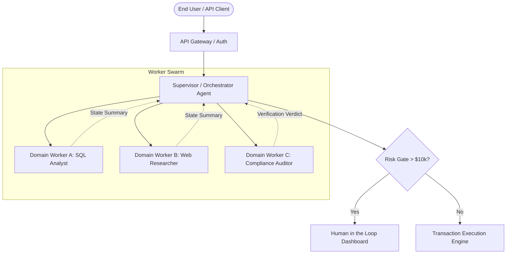

# 📘 Domain 1: Enterprise Multi-Agent Swarms & Systems

**Weight**: 25% | **Exam Questions**: ~15 Questions  
**Core Competencies**: Distributed agent orchestration, supervisor-worker hierarchies, cycle detection & circuit breakers, consensus mechanisms, state synchronization across microservices, resilient handoffs under partial node failure.

---

## 1. 🐝 Enterprise Swarm & Hierarchy Topologies

Enterprise agent architectures scale beyond simple script-based loops into distributed, asynchronous microservices:



### Key Architectural Patterns Tested
1. **Supervisor-Worker (Hierarchical)**: A single orchestrator plans tasks dynamically, delegates to isolated workers, and aggregates results.
2. **Peer-to-Peer Consensus (Voting/Panel)**: Multiple distinct instances critique the same artifact concurrently (e.g. medical diagnosis, fraud detection) to reach $N/M$ consensus before committing.
3. **Sequential Pipeline with Intermediate Circuit Breakers**: Rigid data-pipelines where failure at stage $N$ triggers automated rollback of preceding stages.

---

## 2. ⚡ Circuit Breakers & Cycle Prevention

The primary failure mode of autonomous multi-agent swarms is **runaway recursive loops** (e.g. Worker A asks Worker B, Worker B asks Worker A, exhausting budget and tokens).

### Hard Architectural Controls:
* **Monotonic Step Counters**: Every child agent invocation inherits an immutable `depth` and increments a global `session_step_counter`.
* **State Transition Graph Validation**: Deterministic state machine checks ensuring agents cannot transition backwards without human intervention.
* **Token Budget Allotment**: The orchestrator assigns a hard token allowance (e.g. 50,000 tokens) to each worker sub-session. If exceeded, the orchestrator terminates the worker with a `BudgetExceededException`.

```python
class AgentSessionGuard:
    def __init__(self, max_depth: int = 5, max_total_tokens: int = 100_000):
        self.max_depth = max_depth
        self.max_tokens = max_total_tokens
        self.current_tokens = 0
        self.visited_states = set()

    def assert_transition(self, current_state: str, next_state: str, depth: int, tokens_used: int):
        if depth > self.max_depth:
            raise RecursionError(f"Agent recursion depth {depth} exceeded max {self.max_depth}")
        self.current_tokens += tokens_used
        if self.current_tokens > self.max_tokens:
            raise MemoryError("Session token budget exhausted")
```

---

## 3. 🛡️ Context Isolation & Sanitized Handover

* **Anti-Pattern**: Passing the entire raw `messages` array from Agent A to Agent B (causes token bloat, hallucinations, and prompt injection propagation).
* **Enterprise Standard**: **Sanitized State Handover**. When Agent A completes a task, it compiles a structured Pydantic schema containing only verified facts, discarding its conversational scratchpad before passing the payload to Agent B.
