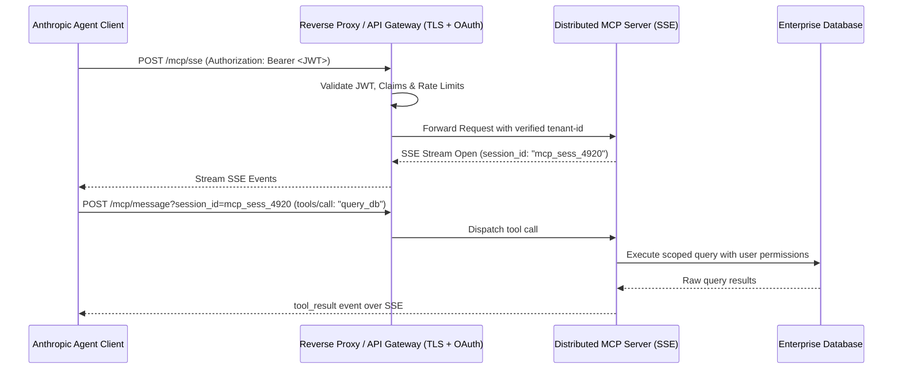

# 📘 Domain 2: Production MCP Architecture & Security

**Weight**: 22% | **Exam Questions**: ~13 Questions  
**Core Competencies**: Remote MCP over Server-Sent Events (SSE), reverse proxying, authentication & authorization (OAuth 2.0, mTLS, JWT bearer tokens), granular tool permission scoping, rate-limiting & session multiplexing.

---

## 1. 🌐 Local stdio vs Distributed Remote SSE

| Dimension | Local MCP (`stdio`) | Enterprise Remote MCP (`sse`) |
|---|---|---|
| **Transport** | Standard In/Out Pipes (`stdin`/`stdout`) | HTTP POST + Server-Sent Events (`/sse`) |
| **Topology** | Single process on local workstation | Distributed microservice across clusters / VPCs |
| **Authentication** | Local OS file/process permissions | mTLS, OAuth 2.0, JWT Bearer tokens |
| **Concurrency** | 1 client process per server instance | Multi-tenant session multiplexing via session IDs |
| **Production Fit** | Desktop apps (Claude Code, Claude Desktop) | Kubernetes pods, API gateways, enterprise microservices |

---

## 2. 🔐 Enterprise Authentication & Session Multiplexing

When deploying MCP servers across corporate networks:

### Security Mandates for MCP in Production:
1. **Never expose unauthenticated MCP endpoints** to the public internet.
2. **mTLS (Mutual TLS)** between internal orchestrators and MCP worker pods.
3. **Least-Privilege Tool Scoping**: Downscope database credentials so the MCP server cannot execute DDL commands (`DROP`, `ALTER`).
