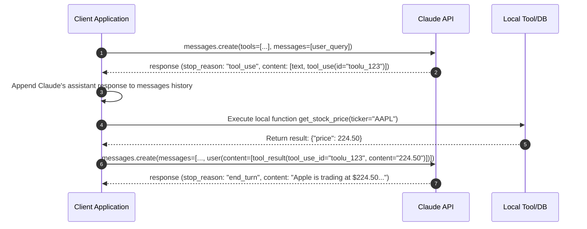

# 📘 Domain 2: Tool Calling & JSON Schemas

**Weight**: 25% | **Exam Questions**: ~15 Questions  
**Core Competencies**: Tool definitions with JSON Schema, Pydantic integration, `tool_choice` modes (`auto`, `any`, `tool`), multi-turn tool loops, `tool_result` handling, error propagation (`is_error: true`).

---

## 1. 🛠️ Tool Definition Schema

Tools are defined as a list of JSON objects conforming to the **JSON Schema Draft 7 / 2020-12** specification.

```python
tools = [
    {
        "name": "get_stock_price",
        "description": "Retrieves real-time stock ticker price and trading volume.",
        "input_schema": {
            "type": "object",
            "properties": {
                "ticker": {
                    "type": "string",
                    "description": "The stock ticker symbol (e.g., AAPL, GOOGL)"
                },
                "currency": {
                    "type": "string",
                    "enum": ["USD", "EUR", "BRL"],
                    "default": "USD",
                    "description": "Target currency code"
                }
            },
            "required": ["ticker"]
        }
    }
]
```

### Pydantic Tool Generation (Pythonic Idiom)
```python
from pydantic import BaseModel, Field

class StockQuery(BaseModel):
    ticker: str = Field(description="The stock ticker symbol (e.g. AAPL)")
    currency: str = Field(default="USD", description="Target currency code")

tool_definition = {
    "name": "get_stock_price",
    "description": "Retrieves real-time stock ticker price.",
    "input_schema": StockQuery.model_json_schema()
}
```

---

## 2. 🎚️ Tool Choice Strategies (`tool_choice`)

The `tool_choice` parameter forces or guides how Claude selects tools:

| Mode Payload | Behavior | When to Use |
|---|---|---|
| `{"type": "auto"}` (Default) | Claude decides whether to call zero, one, or multiple tools, or reply with plain text. | Standard conversation / dynamic assistance. |
| `{"type": "any"}` | Claude **MUST** call at least one tool from the `tools` list, but can choose which one. | Router patterns, triage bots, action agents. |
| `{"type": "tool", "name": "get_stock_price"}` | Claude **MUST** call the specifically named tool. | Strict extraction pipelines, guaranteed single-action step. |

```python
# Example: Forcing a specific tool
response = client.messages.create(
    model="claude-3-5-sonnet-20241022",
    max_tokens=1024,
    tools=tools,
    tool_choice={"type": "tool", "name": "get_stock_price"},
    messages=[{"role": "user", "content": "How is Apple doing today?"}]
)
```

---

## 3. 🔄 The Tool Calling Lifecycle Loop



### Full Production Execution Loop
```python
messages = [{"role": "user", "content": "What is the stock price of GOOGL?"}]

response = client.messages.create(
    model="claude-3-5-sonnet-20241022",
    max_tokens=1024,
    tools=tools,
    messages=messages
)

if response.stop_reason == "tool_use":
    # 1. Append assistant turn to history
    messages.append({"role": "assistant", "content": response.content})
    
    # 2. Process each tool call block
    tool_results = []
    for block in response.content:
        if block.type == "tool_use":
            tool_use_id = block.id
            tool_name = block.name
            tool_args = block.input
            
            try:
                # Execute tool locally
                result_str = execute_tool(tool_name, tool_args)
                tool_results.append({
                    "type": "tool_result",
                    "tool_use_id": tool_use_id,
                    "content": result_str
                })
            except Exception as e:
                # 3. Handle local tool failure gracefully
                tool_results.append({
                    "type": "tool_result",
                    "tool_use_id": tool_use_id,
                    "content": f"Execution error: {str(e)}",
                    "is_error": True
                })
                
    # 4. Return results in user turn
    messages.append({"role": "user", "content": tool_results})
    
    # 5. Final completion call
    final_response = client.messages.create(
        model="claude-3-5-sonnet-20241022",
        max_tokens=1024,
        tools=tools,
        messages=messages
    )
```

---

## 4. ⚠️ Error Propagation (`is_error: true`)

When a tool fails locally (e.g. database timeout, invalid credentials, record not found), **do not crash the client program** or hide the error:
* Return `is_error: True` in the `tool_result` block.
* Claude reads the error message and can autonomously correct its parameters or explain the failure gracefully to the end user.
